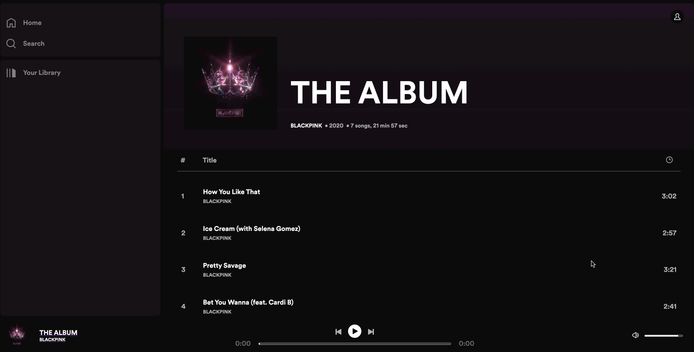
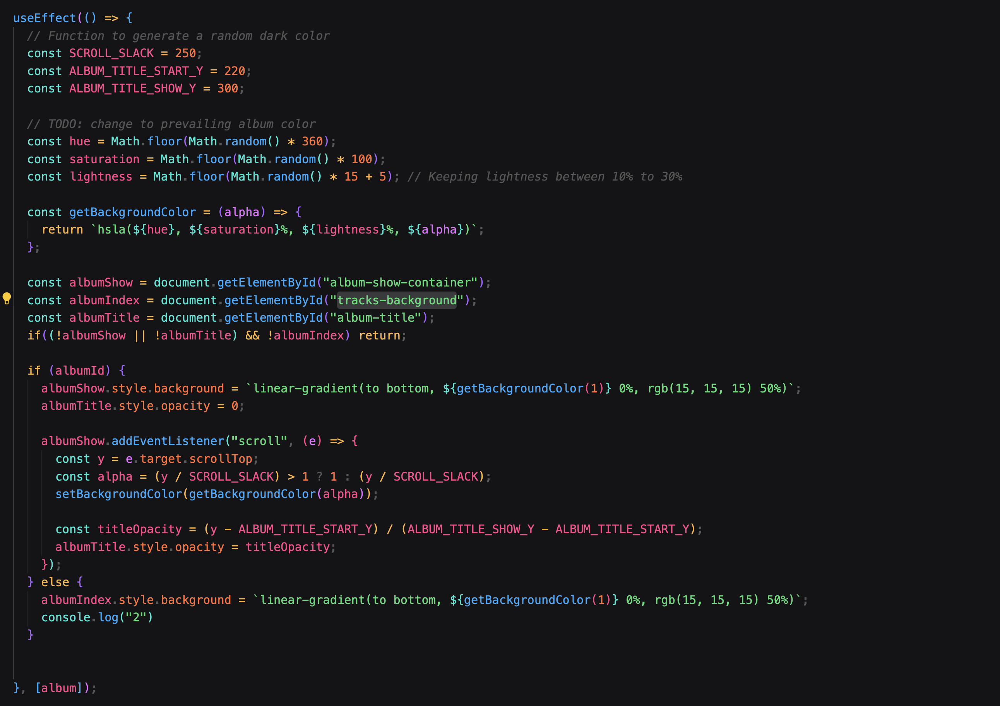

# Spotipie

Spotipie (Spotify clone) is a streaming platform that offers access to a vast library of music, podcasts, and other audio content, personalized to individual preferences.

### Technologies
+ Frontend: React, Redux, Javascript, HTML, and CSS
+ Backend: Ruby, Ruby on Rails, and Jbuilder
+ Database: PostgreSQL
+ Cloud Services: AWS S3

## Features

### Album Page

This functionality enables users to browse the album show page and double-click on a track row to start listening.

### Navigation Bar
This feature was implemented to give the user a better and fun frontend experience when scrolling through the song lists.

## Future Prospects
+ add searching feature
+ add playlist feature